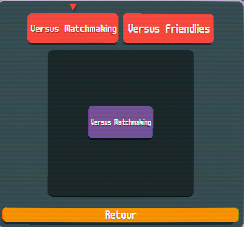
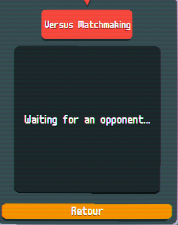
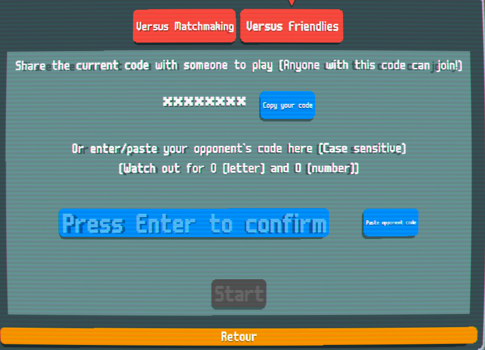
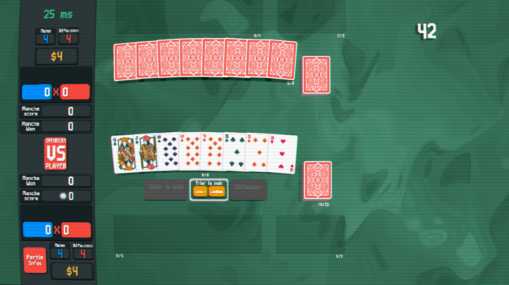
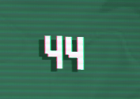

# How to play

Read [Readme](README.md) first and ensure the mod is installed

## Matchmaking

  

Upon hitting the `play` button :

- Random matchmaking : Match against a random opponent

  

- Friendlies : Play against a private opponent by exchanging a join code

  

The join code is generated each time you are in friendlies mode. Use the `Copy your code` button to get the code.
The opponent has to enter the code in his friendlies tab

> [!WARNING]  
> Anyone with the code can join (hence why it's hided), so share with caution

> [!WARNING]  
> Watch out for Zero 0 and the letter O because for some reason they both have the same render ¯\_(ツ)\_/¯

## Rules

The mode is a first to 10 wins. Try to score more points than your opponent over all your hands. The game change a lot during this mode, below are the notables rules / change applied

### UI changes

  

The entire HUD is redesigned to better suit 1v1 mode:

- All of your cards (hand, jokers, deck, and consumeables) are displayed at the bottom. In contrast, your opponent’s cards are shown at the top.
- Below the red `Opponent VS Player` button, you’ll find your score, number of rounds won, hand count, discards, and run information; with the opponent’s equivalent at the top.
- The right side of the screen is dedicated to the play area
- the number in the top right is the timer (more info below)

## Give it all !

There is no ante , play all your hands and try to make more points than your opponent. The round is over when both player have no more hands

## Cashout

At the end of the round, you will get a :

- 4$ for finishing a round
- X$ depending of how many unused discards you have

## Watch out for the time !

  

To prevent the game from stalling, a timer is used to force an action when the countdown ends:

- Play a hand : 45 secs -> play a random card
- Cashout: 15 secs -> Cash out for you
- Shop : 60 secs -> End the shop , skip card if opened a booster

You can't also pause the game or use the original buttons to quit/change options etc...

## Whah about bosses / tags

There are no bosses and tag but might come in a certain way

## Interactions

To make the mods more fun and interactive, some additional 'disruptive' jokers and consumeables have been added. Their goal is to limit or hinder your opponent's play options.

> [!NOTE]  
> I'm not an artist, those cards are blank for now .

> [!IMPORTANT]  
> Potential balance changes may happen to them in the future.

List of new cards and their effects:

| **Name**             | **Type**    | **Description**                                                                                                                                                                                        |
| -------------------- | ----------- | ------------------------------------------------------------------------------------------------------------------------------------------------------------------------------------------------------ |
| **Negate**           | Consumeable | Negate the (futures and ongoing) effect of a joker for this round. Click this card first, then the target joker, and finally use this card.                                                            |
| **Begone! Joker**    | Joker       | Randomly destroy an opponent joker at the end of the round. The owner of this card has to pay {X} at the start of a round to keep this card or destroy it. (X start at 5 and increase by 5 each round) |
| **Jester**           | Joker       | At the start of each round, randomly swap the centers of the opponent's jokers (restoring them if destroyed). The original jokers' effects remain unchanged.                                           |
| **Angel touch!**     | Consumeable | Turn a joker into an eternal card. Click this card first, then the target joker, and finally use this card.                                                                                            |
| **Countdown!**       | Joker       | All opponent jokers become perishable (after 2 rounds). Your opponent has to play a {X} to remove this effect at the end of the round (X being a card to play).                                        |
| **Discard Maestro**  | Joker       | You can now discard more than 5 cards in your hand. Every X amount > 5 will randomly discard an opponent card.                                                                                         |
| **Planet eater**     | Joker       | 1/2 chance to randomly change an opponent's planet card.                                                                                                                                               |
| **Chrono Triggered** | Joker       | Reduce the opponent timer. This can be stacked up to 3 times (1 = 1/4, 2 = 1/3, 3 = 1/2). Unaffected by debuff.                                                                                        |
