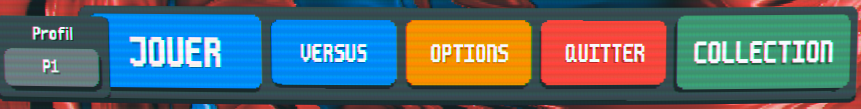

# balatro-vs

<!-- <p align="center">
  
</p> -->

<!-- Shield -->

[![Contributors][contributors-shield]][contributors-url]
[![Download][download-shield]][download-url]
[![Forks][forks-shield]][forks-url]
[![Stargazers][stars-shield]][stars-url]
[![Issues][issues-shield]][issues-url]
[![MIT License][license-shield]][license-url]

# About The Mod

Versus mod for balatro, try to win a first to 10 round against another player.

This mod feature:

- Peer to peer Online 1o1 netplay (Random matchmaking and friendlies)
- Some new disruptives jokers for interaction
- Auto-update
- Probably won't work with other non cosmetic mods

More info at [How 2 play](./HOW2PLAY.MD) (this will probably move to the wiki at some point)

# Install

This mod has only been developed and tested on windows, probably won't work on other platform (but might happen in the future ?)

Also this mod was developed for the 1.0.X version, meaning it will break when an official major update drop (will need some adjustements).

Before starting, i suggest to make a backup of your current save file just in case. You can find your saves in your computer at `%AppData%/Balatro` with folder 1 to 3 being the profiles and the `settings.jkr` file being the current game settings (`steam_autocloud.vdf` is probably some steam related stuff, i think it can be ignored). Copy those somewhere to backup if needed for some reason

This mod run with [lovely-injector](https://github.com/ethangreen-dev/lovely-injector) (tested on version v0.7.1):

- Start by installing [lovely-injector](https://github.com/ethangreen-dev/lovely-injector?tab=readme-ov-file#manual-installation) following the manual installation (the first two steps)

- Grab and extract [latest release](https://github.com/Fcornaire/balatro-vs/releases/latest)

- In the `Release` folder, copy the `balatro-vs` folder to lovely mod folder [Step 3 of lovely manual installation](https://github.com/ethangreen-dev/lovely-injector?tab=readme-ov-file#manual-installation) . If this is the first time you are doing this, then create the folder `Mods` at `%AppData%/Balatro`

- Copy the `winmm.dll` file to your balatro game folder

> [!IMPORTANT] > **Respect the mod architecture.**  
> **winmm.dll** file goes to your balatro game folder (something like `.../Steam/steamapps/common/Balatro`).
>
> **balatro-vs** folder goes to lovely `Mods` folder at `%AppData%/Balatro/Mods`.
>
> The mod **won't** work if not

---

- Launch the game and confirm that lovely console opened and a versus button is present at the main screen

<p align="center">
  
</p>

- Enjoy ! Do not hesitate to open an [issue](https://github.com/Fcornaire/balatro-vs/issues) if you encounter a bug or something isn't working

# Known issue

- For some obscure reason, connection between 2 players might fail. For now, just cancel and restart the matching (Note for me : `failed to open data channel: there already exists a stream with identifier` is what i need to check)

# Building (Developer)

- Clone this repository
- Build the `core` project
- Optionaly,set the environment variable **BALATRO_GAME_PATH** pointing to your own game install (something like _../Steam/steamapps/common/BALATRO/_) for copying the built dll to your game path
- Optionaly, if you also want to copy lua patch to lovely mod folder, build the `copy_lua_patchs` project and run the command

```powershell
cargo run -p copy_lua_patchs
```

The mod use a [matchbox](https://github.com/johanhelsing/matchbox) server for matchmaking. You can use the provided [signaling server](https://github.com/johanhelsing/matchbox/tree/main/matchbox_server#signaling-server) for testing.

The file you want to update to put your server url is `bvs.json` config file in the `patchs` folder.

# Social

Bsky : [Dshad66](https://bsky.app/profile/dshad66.bsky.social)

Twitter : DShad - [@DShad66](https://twitter.com/DShad66)

Discord : dshad (was DShad#4670)

<!-- MARKDOWN LINKS & IMAGES -->
<!-- https://www.markdownguide.org/basic-syntax/#reference-style-links -->

[contributors-shield]: https://img.shields.io/github/contributors/Fcornaire/balatro-vs.svg?style=for-the-badge
[contributors-url]: https://github.com/Fcornaire/balatro-vs/graphs/contributors
[forks-shield]: https://img.shields.io/github/forks/Fcornaire/balatro-vs.svg?style=for-the-badge
[forks-url]: https://github.com/Fcornaire/balatro-vs/network/members
[stars-shield]: https://img.shields.io/github/stars/Fcornaire/balatro-vs.svg?style=for-the-badge
[stars-url]: https://github.com/Fcornaire/balatro-vs/stargazers
[issues-shield]: https://img.shields.io/github/issues/Fcornaire/balatro-vs.svg?style=for-the-badge
[issues-url]: https://github.com/Fcornaire/balatro-vs/issues
[license-shield]: https://img.shields.io/github/license/Fcornaire/balatro-vs.svg?style=for-the-badge
[download-shield]: https://img.shields.io/github/downloads/Fcornaire/balatro-vs/total?style=for-the-badge
[download-url]: https://github.com/Fcornaire/balatro-vs/releases
[license-url]: https://github.com/Fcornaire/balatro-vs/blob/master/LICENSE.txt
